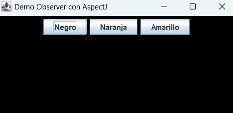
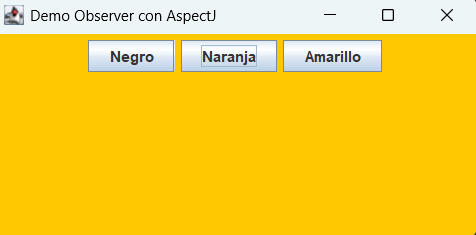
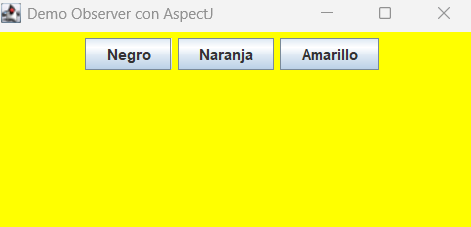
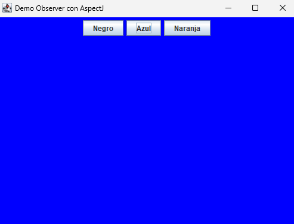

# Aspectos
Tarea 1(Grupo 5)

# Cambios de botón de color (Pablo Chacón)

# Funcionalidad Adicional: Ventana Iniciada
Se implemento una función en el mensaje de consolo cuando la ventana ha iniciado. El mensaje indicia que el problema está funcionando correctamente y el usuario tiene acceso a interactuar con el problema. Se imprimio en la consola la frase "Ventana iniciada. Listo para cambiar colores.".

## Funcionalidad Adicional: Sonido

Con el aspecto **SoundAspect** interceptamos cada llamada a  
`subject.Color.setColor(java.awt.Color)` y emitimos un “beep” del sistema  
usando `Toolkit.getDefaultToolkit().beep()`.  

- **Punto de unión**: todas las ejecuciones de `setColor(...)`.  
- **Advice**: `after` — se dispara justo después de cambiar el color.  
- **Objetivo**: mostrar cómo AOP permite inyectar funcionalidades (audio, logging, métricas, etc.)  
  sin modificar la lógica de la GUI ni el modelo de datos.  

